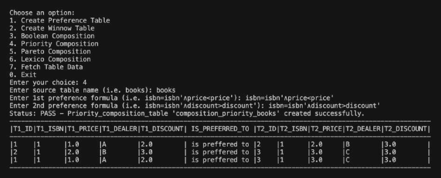

# Preference-Based SQL Query Optimization

A Python + PL/SQL implementation of **preference-based query optimization** using the **Winnow Operator** and various **preference composition techniques**. This project enhances standard SQL querying capabilities by enabling user-centric filtering and ranking of database tuples based on customized preference formulas.



## ✨ Features

* **Winnow Operator** — Filter non-dominated tuples according to user-defined preferences.
* **Preference Compositions** — Supports Boolean, Priority, Pareto, and Lexicographic compositions for multi-criteria decision-making.
* **Generic Design** — Adaptable to any relational dataset.
* **Interactive CLI** — Menu-driven Python script to run preference queries dynamically.
* **Tech Stack** — Python, Oracle SQL/PL-SQL, Oracle SQL Developer.

## 🧠 Concept Overview

### Preferences & Winnowing

* **Preference**: Determines if a tuple is preferred over others based on a given condition.
* **Winnowing**: Returns tuples that are **not dominated** by any other tuple.

### Composition Techniques

1. **Boolean Composition** — Union, Intersection, Difference of two preference relations.
2. **Priority Composition** — One preference takes precedence; fallback to secondary preference when indifference occurs.
3. **Pareto Composition** — Multi-dimensional preference without strict attribute prioritization.
4. **Lexico Composition** — Sequentially prioritized attribute preferences.

## 🛠️ Installation Instructions

### Prerequisites

* Oracle Database (Configured)
* Python 3.x
* Python `oracledb` package:

  ```bash
  pip install oracledb
  ```

### Setup Steps

1. Ensure Oracle DB is running.
2. Source tables like `books` and `dealers` should exist in the schema (pre-created in `LDB24_USER_05`).
3. Configure DB connection parameters in the Python script.
4. Adjust input variables for test cases if necessary.
5. Run the script:

   ```bash
   python script.py
   ```

## 🖥️ Usage Guide

Upon running the script, you’ll see an interactive menu:

| Option | Action                           |
| ------ | -------------------------------- |
| 1      | Create Preference Table          |
| 2      | Create Winnow Table              |
| 3      | Boolean Composition (AND/OR/NOT) |
| 4      | Priority Composition             |
| 5      | Pareto Composition               |
| 6      | Lexico Composition               |
| 7      | Display Table Data               |
| 0      | Exit                             |

### Example Usage

1. Choose an option (e.g., **1** for Preference Table).
2. Enter table name (`books` or `dealers`).
3. Enter a preference formula (Examples will be shown on-screen).
4. View the result directly in the terminal.

⚠️ **Note**: Input validation assumes correct inputs by the user (e.g., valid table names and formula syntax).

## 📂 Project Structure

```
├── script.py                # Main Python script (CLI-based)
├── README.md                # This file
└── (SQL scripts if needed)  # SQL files for table creation (optional)
```
